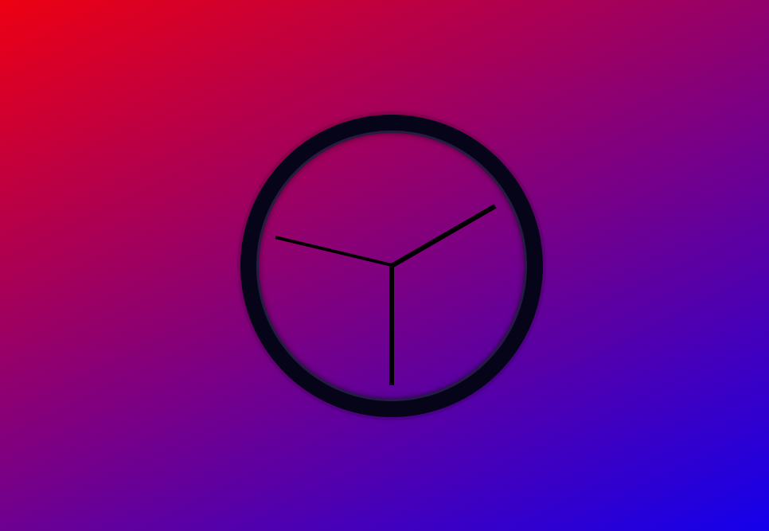
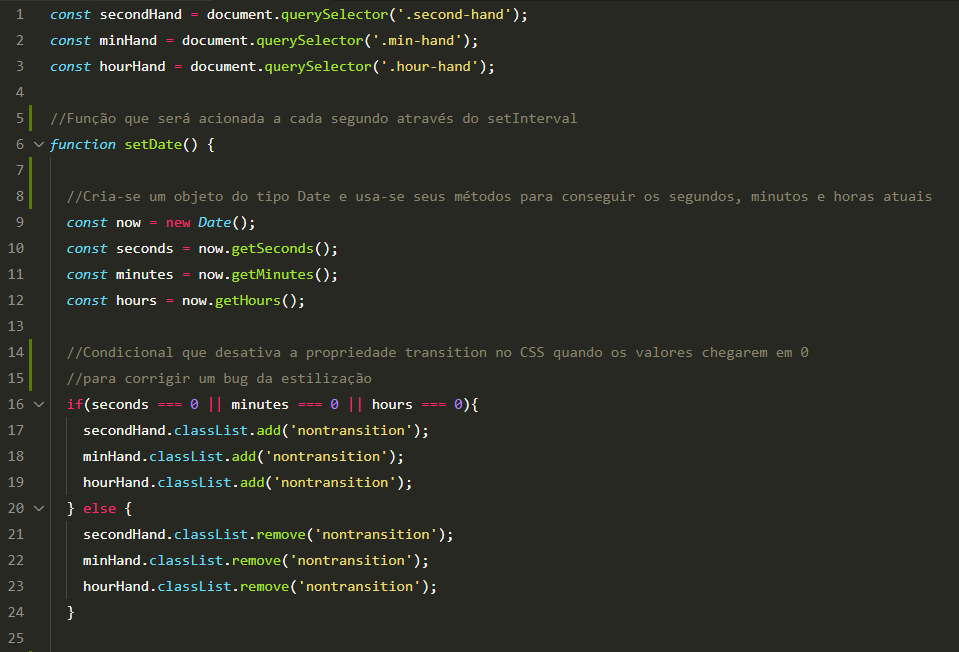
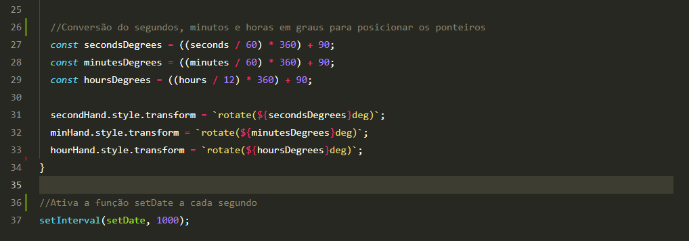

# Clock 
Neste projeto, com o JavaScript, conseguimos ter acesso ao horário atual e mover os ponteiros fazendo uma conversão do tempo para os graus que cada ponteiro deve ocupar no relógio.  

   

